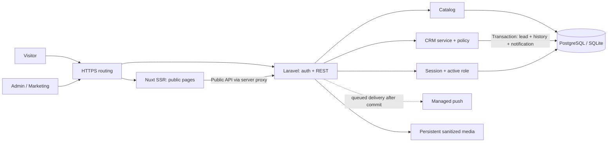
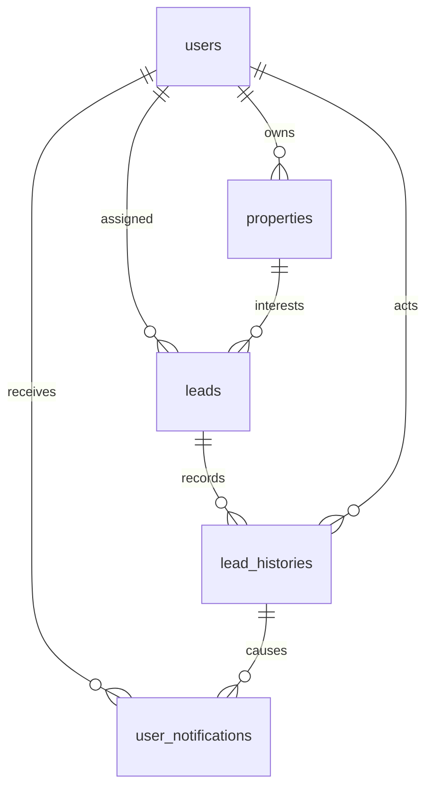

# Arsitektur fondasi

## Perluasan katalog berbasis sumber — 2026-10-05

CommercialController mempertahankan modular monolith/Eloquent: transaksi khusus Admin untuk kolom jadwal harga dan JSON commercial, fresh lock, optimistic version dan ActivityLog. Property menyediakan ekspresi harga portabel SQLite/PostgreSQL agar public resource, filter, sort, detail dan compare memakai tanggal Asia/Jakarta yang sama. Public commercial dan payment_plans mempunyai allowlist tersendiri; metadata verifikasi tidak keluar. CHECK_REQUIRED tidak menyatakan stok. MASTERPLAN melewati MediaProcessor/MediaDisk existing dan tetap memiliki revocation checks.

SiteContent menambah DEVELOPMENT fixed schema dan FinancingContent memusatkan validasi/normalisasi BANK_RATE. Kontak/fasilitas publik diambil dari CMS melalui composable Nuxt. Kernel simulasi anuitas pure mendukung reset bunga bertahap berdasarkan sisa saldo, tanpa koneksi bank, pengajuan kredit, atau layanan baru. CommercialEditor dan PropertyCommercial memakai komponen/form/layout yang sudah ada; tema/CSS editorial tidak diganti.

Vercel Git build memvalidasi kode sebelum publish. Produksi mengikuti `main`; Laravel migrasi aditif dijalankan sesudah check build, tanpa seed. PostgreSQL Supabase dan R2 private tetap sumber persisten; perubahan CMS tidak memerlukan rebuild. GitHub Actions tidak digunakan. Rekonsiliasi data dan batas sumber: brochure-kpr-research.md.

Modular monolith dengan Nuxt SSR terpisah dari Laravel, satu database dan struktur Eloquent standar. Service hanya dipakai ketika sebuah operasi bisnis membutuhkan transaksi/otorisasi/concurrency; tidak menambah generic repository atau interface untuk implementasi tunggal.

Browser memakai same-origin API. Nuxt mem-proxy public GET melalui allowlist dan POST analytics strict; session/CSRF/private routes diteruskan oleh web reverse proxy. Lokal gunakan Nitro devProxy untuk private routes. Public SSR tidak meneruskan cookie. Production `/api`, `/auth`, `/sanctum`, `/media`, `/up`, `/ready` ke Laravel; `/login` ke Nuxt. Alternatif subdomain harus menyesuaikan Sanctum/CORS/cookie dan diuji dahulu.

| Module | Ownership | Boundary |
|---|---|---|
| Identity | User, login/logout, active-role middleware | Tidak mengirim email/password dalam resource public |
| Catalog | Property, public resource, scoped CRUD | Tidak mengakses data lead pada public response |
| CRM | Lead/history/notifications, workflow service | Atomic mutation, version condition, scoped policy |
| Public frontend | Home/list/detail, card, canonical/WA | Hanya public DTO, SSR API failure tidak diperlakukan missing |
| Backoffice frontend | Client login/list/status/notes/history | Backend tetap menegakkan policy; noindex/no-store |
| KPR kernel | Pure amortization function | Fixed/floating reset+schedule/UI; current verified editorial bank references, bukan bank approval |

## ERD fondasi

Index, constraints, types dan query conventions ada di SRS§9 serta migrations. Histori menyimpan relasi aktor dan perubahan assignee; tidak menyimpan password/WA di payload push. Notes disatukan dengan timeline untuk menghindari dua sumber fakta.

## Failure boundaries

Workspace operasi menambahkan AccountOperations sebagai batas transaksi akun (version, last-active-Admin lock, workload guard, revoke sessions/reset tokens, audit) serta ActivityLog readonly. Property transfer adalah operasi Admin terpisah; CRM contact correction menggunakan LeadWorkflow dengan CONTACT_UPDATED append-only. Query list memakai eager loading relasi ringkas untuk mencegah N+1 dan dropdown menggunakan search/pagination sehingga tidak menganggap100 akun/properti pertama sebagai seluruh pilihan. Recovery memakai password broker Laravel dengan frontend URL konfigurasi trusted; tidak menggunakan host header untuk tautan email. Tidak menambah repository/event bus atau layanan identitas tambahan.

API validation422 tidak mengubah data. Version/transition/duplicate409 tidak menghasilkan histori/notification baru. Unauthorized scoped object404; unknown role403/inactive403; expired session401; CSRF419. Provider push gagal sesudah commit: data tetap tersimpan, retry/backoff dan persisted notification tetap tersedia. Public API unavailable: SSR503 dengan retry, bukan daftar demo diam-diam. Database/storage release path persisten agar deploy tidak menghapus data.

Dataset demo adalah tooling opt-in local/testing pada database domain kosong, bukan lapisan mock aplikasi. Faker menghasilkan katalog/identitas/CMS sintetis, GD menghasilkan ilustrasi, dan service CRM/media membangun histori/notifikasi/job pada transaksi database yang sama. Worker memproses media setelah transaksi terlihat; publik hanya mendapatkan allowlist normal. Nilai tersimpan dapat berubah melalui UI/API dan bertahan setelah reload. Tidak menambah endpoint demo, dependency runtime, atau pola arsitektur baru. Detail dan konfigurasi ada di demo-data.md.

## Scaling path

Media menggunakan private disk, PropertyMedia registry dan job database dalam transaksi yang sama dengan version/audit; worker visibility sesudah commit. Decode+WebP variants640/1280/1920; public file handler memeriksa publication/state/flag pada setiap request dan tidak mengirim path sumber. PDF scanner terpisah concrete service agar contract dapat diuji, bukan generic repository/interface. List eager-load single photo cover melalui aggregate position/id; detail eager-load gallery bounded, internal media paginated. Cleanup/recovery CLI eksplisit, grace30 hari/audit dipertahankan. Media storage belum memakai S3/CDN sehingga tidak memerlukan SDK tambahan.

Pertama ukur p95/error/query volume; batasi payload, perbaiki indeks, optimalkan media. PostgreSQL dapat dipindahkan ke managed service, Nuxt ke Node hosting terpisah, media ke object storage melalui Laravel filesystem ketika kebutuhan nyata muncul. Horizontal Laravel memerlukan shared session/cache/queue serta database bersama. SQLite hanya satu instalasi ringan; tidak untuk multi-instance. Redis/full text/worker service ditambahkan berdasarkan evidence, bukan persiapan spekulatif.

## Editorial dan evaluasi

SiteContent adalah tiga schema fixed HERO/TESTIMONIAL/BANK_RATE, Admin-only full validation/attestation/version/audit. Public DTO tersendiri tanpa identity verification actor; query tanggal rate Asia/Jakarta dan public published cover menghindari bocor draft. POI JSON bounded20 hidup bersama property/version dan hanya detail public, sesuai kebutuhan baca seluruh referensi sekaligus tanpa spatial query. Compare query bounded3 menjaga urutan/public scope; localStorage IDs saja. KPR pure monthly annuity dengan reset remaining balance/term, annual chart dan accessible schedule. Tidak menambah generic CMS, mapper/repository, chart SDK atau map SDK. Sitemap index/property pages bounded1000 dengan live publication filtering.
## Durable push delivery

Pusher delivery adalah adapter konkret kecil untuk dua operasi protokol terdokumentasi, menggunakan PHP hash_hmac dan Laravel HTTP. Tidak ada event bus atau SDK backend baru. SDK resmi Echo/Pusher hanya dimuat pada client ketika konfigurasi enabled+ready. Database queue pada koneksi aplikasi menyimpan job di dalam transaksi CRM; worker hanya melihat committed rows. Provider HTTP tidak dipanggil dari transaksi. Source of truth tetap user_notifications, bukan WebSocket. UUID payload/no PII, optimistic CRM/history atomicity dan session revocation tetap berlaku.

## Laporan dan minimisasi data

LeadReport membaca satu cohort select≤50.000 rows tanpa kontak, exact median menyimpan durasi saja. Index created_at/id dan history lead_id/created_at/id, tidak membutuhkan warehouse/event bus. Cohort/current assignee berbeda dari actor follow-up. Daily funnel aggregate atomic bukan identitas/event stream/integrasi WhatsApp.

LeadPrivacy merupakan CLI khusus redaksi terverifikasi, bukan API editing histori. Lock fresh Admin+lead/version; contact/historynotes/oldLEADaudittext+appendprivacylog atomik. Original status/time/actor retained; redacted_at menandai redaksi. Phone nullable menghapus identitas tanpa hash kontak yang masih bisa dilacak. Rows retained for metrics/FK, mutations blocked. Policy/backup redaction replay gate; execution defaultdisallowed.

## Edge trust dan operational acceptance

Nuxt client-IP middleware memakai socket+exact trusted hops, private HMAC metadata untuk internal SSR requestFetch dan signature path/method/time/IP ke Laravel public routes. Backend memakai request-time explicit TrustProxies subclass dan HMAC verification; tidak wildcard proxy trust atau cookie forwarding ke public API. Rate limiter tidak menggabungkan seluruh pengguna SSR ke alamat Node. Private routes tetap edge→Laravel same-origin. Key≥32random bytes, exact host/proxy allowlists dan canonical origin adalah environment hosting, bukan credential hardcoded.

Nonce CSP per response pada built SSR melindungi hidrasi/render script dan membatasi frame/connect provider. Referrer policy login/backoffice same-origin diperlukan Sanctum session GET; recovery no-referrer menjaga token. JSON request logs tidak menyimpan PII/SQL/query; exception report class/code saja. Readiness hanya technical live dependencies/config, Admin ops queue/media/backup metadata; tidak menggantikan provider/offsite/security/content gate. Backup marker private hanya written oleh operator setelah bukti pipeline, bukan application-generated claim. SQLite WAL/busy_timeout5000/synchronousFULL tetap satu ringan instance; PostgreSQL dipakai untuk acceptance10k/50k/load. Windows local8workers+OPCache hanyalah model proses PHP terukur, bukan layanan baru deployment.
