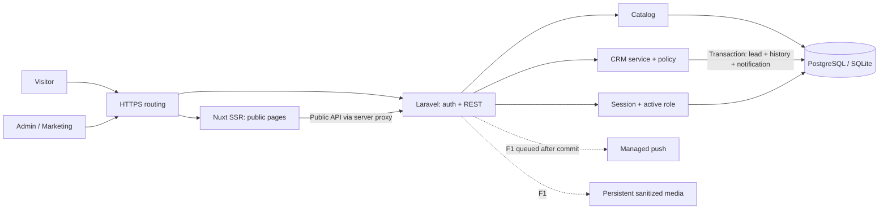
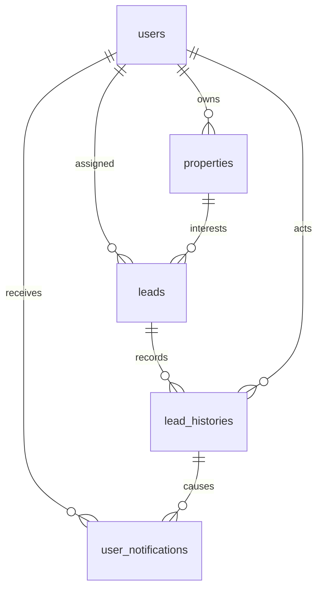

# Arsitektur fondasi

Modular monolith dengan Nuxt SSR terpisah dari Laravel, satu database dan struktur Eloquent standar. Service hanya dipakai ketika sebuah operasi bisnis membutuhkan transaksi/otorisasi/concurrency; tidak menambah generic repository atau interface untuk implementasi tunggal.

Browser memakai same-origin API. Nuxt hanya mem-proxy public GET melalui allowlist; session/CSRF/private routes diteruskan oleh web reverse proxy, bukan proxy Nuxt generik yang menerima arbitrary destination. Lokal gunakan Nitro devProxy untuk private routes. Public SSR tidak meneruskan cookie. Production `/api`, `/auth`, `/sanctum` ke Laravel; `/login` ke Nuxt. Alternatif subdomain harus menyesuaikan Sanctum/CORS/cookie dan diuji dahulu.

| Module | Ownership | Boundary |
|---|---|---|
| Identity | User, login/logout, active-role middleware | Tidak mengirim email/password dalam resource public |
| Catalog | Property, public resource, scoped CRUD | Tidak mengakses data lead pada public response |
| CRM | Lead/history/notifications, workflow service | Atomic mutation, version condition, scoped policy |
| Public frontend | Home/list/detail, card, canonical/WA | Hanya public DTO, SSR API failure tidak diperlakukan missing |
| Backoffice frontend | Client login/list/status/notes/history | Backend tetap menegakkan policy; noindex/no-store |
| KPR kernel | Pure amortization function | Belum bank offers/floating product UI |

## ERD fondasi

Index, constraints, types dan query conventions ada di SRS§9 serta migrations. Histori menyimpan relasi aktor dan perubahan assignee; tidak menyimpan password/WA di payload push. Notes disatukan dengan timeline untuk menghindari dua sumber fakta.

## Failure boundaries

API validation422 tidak mengubah data. Version/transition/duplicate409 tidak menghasilkan histori/notification baru. Unauthorized scoped object404; unknown role403/inactive403; expired session401; CSRF419. Provider push F1 gagal sesudah commit: data tetap tersimpan, retry/backoff dan persisted notification tetap tersedia. Public API unavailable: SSR503 dengan retry, bukan daftar demo diam-diam. Database/storage release path persisten agar deploy tidak menghapus data.

## Scaling path

Pertama ukur p95/error/query volume; batasi payload, perbaiki indeks, optimalkan media. PostgreSQL dapat dipindahkan ke managed service, Nuxt ke Node hosting terpisah, media ke object storage melalui Laravel filesystem ketika kebutuhan nyata muncul. Horizontal Laravel memerlukan shared session/cache/queue serta database bersama. SQLite hanya satu instalasi ringan; tidak untuk multi-instance. Redis/full text/worker service ditambahkan berdasarkan evidence, bukan persiapan spekulatif.
